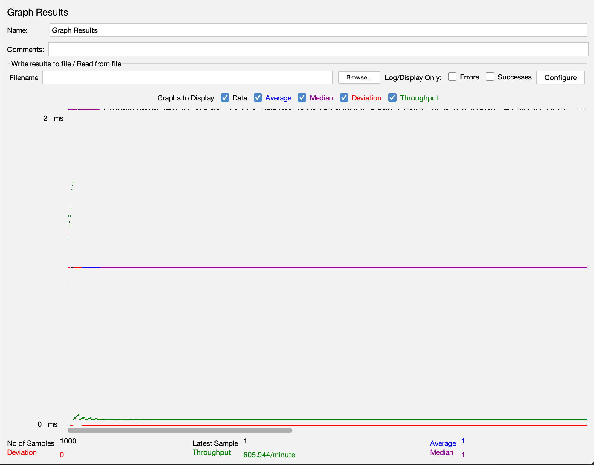

# Quran API

The Quran API is a lightweight and fast API written in Go (Golang) that provides access to the Quranic text. It allows developers to retrieve Quranic verses, chapters, translations, and other related information easily. This API aims to provide a simple and efficient way to integrate Quranic data into various applications and services.

## Benchmark
Tested with specs:

| Hardware | Value             |
|----------|-------------------|
| CPU      | Intel i7 - 7820HQ |
| RAM      | 16GB              |

Got 605K++ req / minutes



## How to Run the Project

To run the project, follow the steps below:

1. Clone the repository:

```bash
$ git clone git@github.com:fachryansyah/Quran-API.git
```

2. Navigate to the project directory:

```bash
$ cd Quran-API
```

3. Build the project:

```bash
$ make build
```

4. Run the project:

To run the project in development mode, use the following command:

```bash
$ make run-dev
```

To run the project in production mode, use the following command:

```bash
$ make run-prod
```

## License

This project is licensed under the MIT License - see the [LICENSE](LICENSE) file for details.

## Contribution

Contributions are welcome! If you would like to contribute to this project, please follow the guidelines below:

1. Fork the repository.
2. Create a new branch for your feature or bug fix.
3. Make your changes and ensure that the code compiles successfully.
4. Write appropriate tests for your changes, if applicable.
5. Commit your changes and push them to your forked repository.
6. Submit a pull request, explaining the changes you have made.

Please note that all contributions will be reviewed before they are merged into the main project. 

## Contact
For any questions or inquiries, please contact [fachryansyah123@gmail.com].

Happy coding!